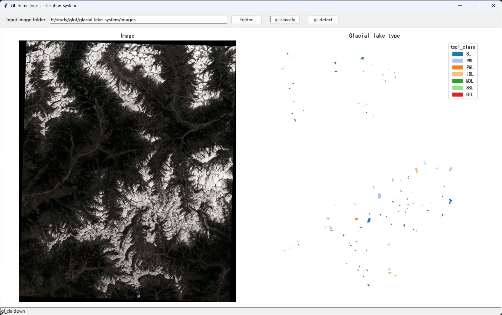

# GL_DCS
Automatic detection and classification system for glacial lake
# Install
This system is based on the YOLO26 and SAM2 models. For instructions on setting up the runtime environment, please refer to the link below.
YOLO26:https://github.com/ultralytics/ultralytics
SAM2:https://github.com/facebookresearch/sam2?tab=readme-ov-file
# Run
One way: running main.py Edit Modify the image folder and task parameters(in_tif,task)  
Another way: running gls_che_windows.py Select an input image folder and click task (gl_classify or gl_detect)
# Result
The results are saved in the folder containing the image

