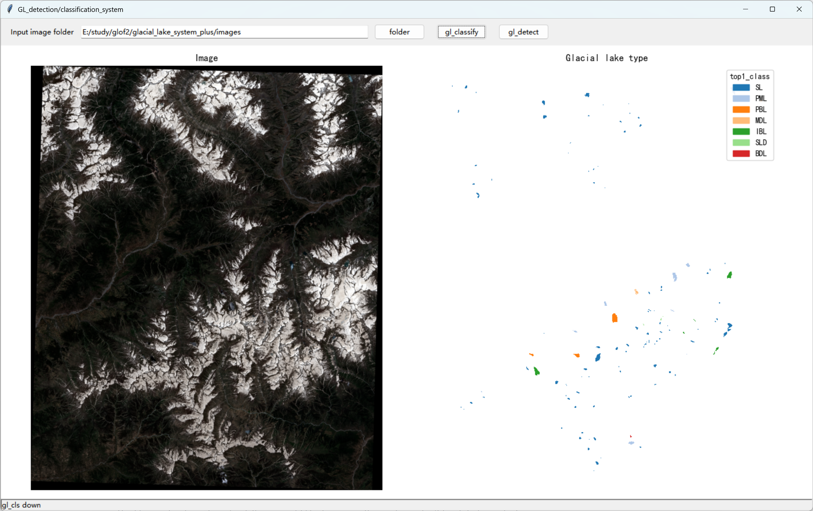

# GL_DCS
An automatic detection and classification system for glacial lake.  
This is the official implementation of the paper "A multi-task framework for seven-class glacial lake mapping to support hazard assessment". 
Authors:Lusheng Che, Quntao Duan, Baili Chen, Renjie Huang, Tingting Sun, Kaiyu Liu, Lihui Luo*
# Installation
This system is based on the YOLO26 and SAM2 models. For instructions on setting up the runtime environment, please refer to the link below.
YOLO26:https://github.com/ultralytics/ultralytics
SAM2:https://github.com/facebookresearch/sam2?tab=readme-ov-file
# Study Area
This system is developed based on  multisource satellite imagery across the Hindu Kush-Himalaya. 
# Run
One way: running main.py Edit Modify the image folder and task parameters(in_tif,task)  
Another way: running gls_che_windows.py Select an input image folder and click task (gl_classify or gl_detect)
# Result
The results are saved in the folder containing the image.  
         

  
# Accuracy
For glacial lake detection, achieving a  Precision  of 0.948, Recall of 0.877, AP50 of 0.921, and AP50-95 of 0.628. 
For glacial lake classification, achieving a Top-1 Accuracy of 0.767. 
Checkpoints(Weights)  
The files are too large to upload. If you would like to receive them, please don’t hesitate to contact us. 
E-mail:lushche@163.com
